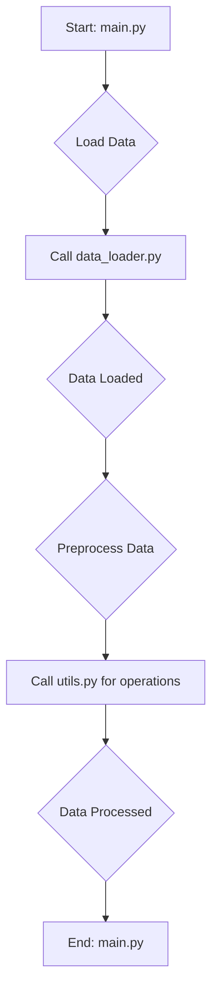

# Rubin Visits Dashboard
## Code to make dashboard showing Rubin LSST progress for a list of targets.
---
## Project Structure
```
rubin-dash/
├── src/
│   └── rubin_dash/
│        ├── core.py      # main classes and functions
│        ├── utils.py     # subroutines for main classes and functions
│        └── __init__.py  # INCOMPLETE
├── templates/
│    └── index.html       # overall webpage structure
├── static/
│   ├── css/
│   │    └── style.css    # CSS for styling webpage
│   └── js/
│        ├── main.js      # main javascript for webpage
│        └── plot.js      # javascript for plots (NOT USED YET)
├── docs/                 # INCOMPLETE
├── tests/
│    └── test_comet.py    # INCOMPLETE
├── schema.sql            # schema for PostgreSQL database
├── test_runner_v4.py     # runner to generate simulated daily updates
├── pyproject.toml        # INCOMPLETE
└── plot_runner.py        # runner to generate resource tracking plots
```
---

## `test_runner_v4.py` Workflow

This diagram illustrates the workflow of the current runner script:

