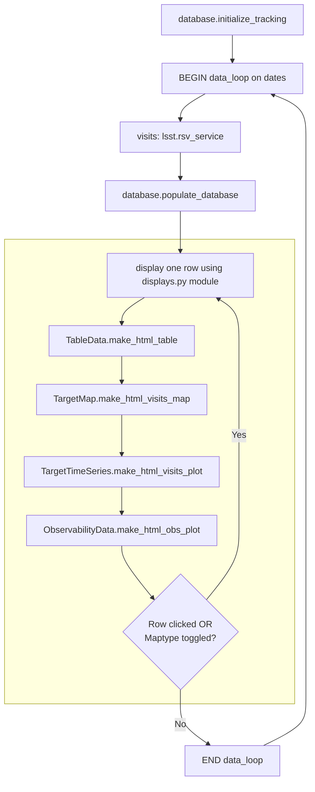

# Rubin Visits Dashboard
## Code to make prototype dashboard showing Rubin LSST progress for a list of targets.

The current version is in a prototyping phase, using data from either the Rubin Schedule Viewer (RSV) or a simulated database (best for offline functionality). Incrementing of observing dates is simulated at a cadence of seconds to minutes, to illustrate how the displays will update with survey progress. The RSV database does **not** include camera angles or bands for the scheduled/completed observations - for now these are simulated and the resulting visits maps/plots should only be interpreted as examples, not reflecting the actual camera/filter settings of the observations. The simulated database offers more realistic camera angles and filter distributions.

---
## Project Structure
```
rubin-dash/
├── src/
│   └── rubin_dash/
│        ├── __init__.py
│        ├── __main__.py       # entry point
│        ├── config.py         # parameters and tunables
│        ├── lsst.py           # Rubin LSST services
│        ├── utils.py          # simulation routines for prototyping
│        ├── database.py       # database setup for user-selected targets
│        ├── observability.py  # functions for forecasting plots
│        ├── displays.py       # prepare display data and make HTML plots
│        ├── pipeline.py       # main background data loop
│        ├── state.py          # thread-safe shared state; links pipeline to app
│        ├── app.py            # Flask app factory and routes
│        └── monitoring.py     # memory/CPU usage monitoring/stress tests
├── templates/
│   └── index.html             # overall webpage structure
├── static/
│   ├── css/
│   │    ├── colors-<name>.css # color palettes for webpage
│   │    └── style-shared.css  # CSS for styling webpage
│   └── js/
│        ├── main.js           # main javascript for webpage
│        └── handlers.js       # javascript for webpage interactions
├── docs/                      # INCOMPLETE
├── tests/
│    └── test_comet.py         # INCOMPLETE
├── logs/                      # log files, plots of memory/CPU usage monitoring
├── schema.sql                 # PostgreSQL database schema to store user targets
└── pyproject.toml        
```
---

## Prototyping workflow

Set the following parameters in `config.py`:
- `QUERY_FILE` - the input file with RA/dec coordinates of list of tartets.
- `OUTPUT_BASE` - where you would like the log files to be stored (defaults to `logs` directory in the same directory as the codebase).
- `REFRESH_INTERVAL` - cadence (in seconds) at which to simulate dates incrementing.
- `SIM_START`, `SIM_END` - start and end dates to simulate (make sure these are within Rubin DP1 or current pre-LSST observing run).

Run the code like this:

`python -m rubin_dash`

The web-app should open in your default web browser, and the displays (table and plots) should appear after a few seconds of 'Data Loading' displayed.

This diagram illustrates the workflow of the main data loop in `pipeline.py`:


