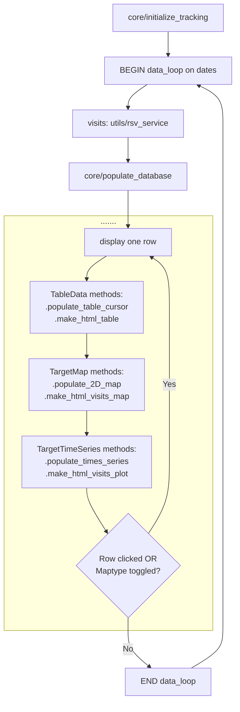

# Rubin Visits Dashboard
## Code to make dashboard showing Rubin LSST progress for a list of targets.
---
## Project Structure
```
rubin-dash/
├── src/
│   └── rubin_dash/
│        ├── __init__.py
│        ├── __main__.py   # entry point
│        ├── config.py     # tunables
│        ├── core.py       # main classes and functions
│        ├── utils.py      # support routines for classes and functions
│        ├── state.py      # thread-safe shared state
│        ├── pipeline.py   # data loop and helpers
│        └── app.py        # Flask app factory and routes
├── templates/
│   └── index.html        # overall webpage structure
├── static/
│   ├── css/
│   │    └── style.css     # CSS for styling webpage
│   └── js/
│        ├── main.js       # main javascript for webpage
│        └── plot.js       # javascript for plots (NOT USED YET)
├── docs/                  # INCOMPLETE
├── tests/
│    └── test_comet.py     # INCOMPLETE
├── schema.sql             # schema for PostgreSQL database
├── pyproject.toml        
└── plot_runner.py         # performance diagnostics plots
```
---

## `test_runner_v4.py` Workflow

This diagram illustrates the workflow of the current runner script:


