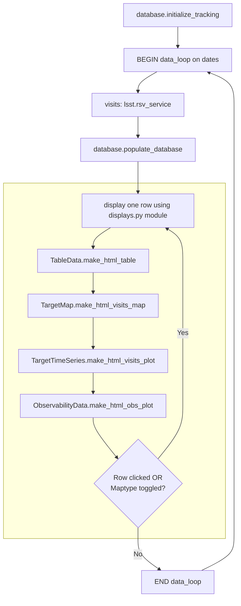

# Rubin Visits Dashboard
## Code to make prototype dashboard showing Rubin LSST progress for a list of targets.

The current version is in a prototyping phase, using data from either the Rubin Schedule Viewer (RSV) or a simulated database (best for offline functionality). Incrementing of observing dates is simulated at a cadence of seconds to minutes, to illustrate how the displays will update with survey progress. The RSV database does **not** include camera angles or bands for the scheduled/completed observations - for now these are simulated and the resulting visits maps/plots should only be interpreted as examples, not reflecting the actual camera/filter settings of the observations. The simulated database (baseline_v3.3_200day.db is the version that ships with the code) offers more realistic camera angles and filter distributions.

## Installation of demo version

1. Clone the project repository from github:

    `git clone git@github.com:aordog/rubin-dash.git`

2. Switch to the `rubin-dash` directory, create a new environment (recommended to avoid dependency conflicts), and activate the environment:

    `python -m venv .rubin_test_venv`

    `source .rubin_test_venv/bin/activate`

3. Install the dashboard in editable mode:

    `pip install -e .`

## Dependencies

The code requires `PostgreSQL` for building the user-specific database that provides the data to the plots. This needs to be installed separately.

### Linux:
Tested on Ubuntu 24.04.4 by Anna Ordog.
1. Install via command line:

    `sudo apt install postgresql postgresql-contrib`
2. Create a PostgreSQL user matching OS username, which lets you create or delete databases without being admin.

    `sudo -u postgres createuser --createdb $(whoami)`

3. Create a test database to check:

    `createdb mydb`

4. Connect to it:

    `psql mydb`

5. Quit `psql` using `\q`; delete the test database using `dropdb mydb`

### Mac OS:
Tested on MacOS Tahoe 26.5.1 by Eric Wang
1. Download and install from: https://www.enterprisedb.com/downloads/postgres-postgresql-downloads. A password setup will be required during installation.
2. Export the `psql` path, removing the decimal from the version number (e.g. 18.4->18):

    `export PATH=$PATH:/Library/PostgreSQL/(version number)/bin`

3. Launch `psql`:

    `psql -U postgres`

    User will be prompted for the password that was set during installation.
4. Create a PostgreSQL user matching OS username, which lets you create or delete databases without being admin. NOTE: the semincolon at the end of the line is required in `psql`

    `CREATE USER (user) WITH SUPERUSER;`

    `CREATE DATABASE (user) OWNER (user);`

    `ALTER USER (user) WITH PASSWORD '(new password)’;` (can be different password from initial installation)
5. Quit `psql` using `\q`, run again to test: `psql` - it should now let you log in with your own user profile.

6. Permanently set the required path in the configuration file:

    `echo 'export PATH=$PATH:/Library/PostgreSQL/(version number)/bin' >> ~/.zshrc`
7. Permanently set the password in the configuration file so that password prompting no longer occurs:

    `echo 'export PGPASSWORD="(new password)"' >> ~/.zshrc`

    `source ~/.zshrc`

    NOTE: may first need to allow user to modify config file: `sudo chown (user) ~/.zshrc`


## Demo/Prototyping workflow

Set the following parameters in `config.py`:
- `QUERY_FILE` - the input file with RA/dec coordinates of list of targets (code ships with 3 examples: `small_query.txt`, `medium_query.txt`, `large_query.txt`).
- `QUERY_TYPE` - `SIM` to use simulated database; `RSV` to use Rubin Schedule Viewer (currently not available).
- `OUTPUT_BASE` - where you would like the log files to be stored (defaults to `logs` directory in the same directory as the codebase).
- `REFRESH_INTERVAL` - cadence (in seconds) at which to simulate dates incrementing.
- `SIM_HIST` - earliest date to include in historical population of the target list-specific database.
- `SIM_START` - the simulated start date of the user query (must be later than `SIM_HIST`).
- `SIM_END` - the simulated date on which to end updating the dashboard (must be later than `SIM_START`)
- `DAYS_FORECAST` - the number of ahead days for which to calculate the observability of each target.

**Run the code like this:**

`python -m rubin_dash`

Note, **using the medium example query** (663 targets), before the dashboard is displayed:

1. The 'historical' data (between `SIM_HIST` and `SIM_START`) takes ~16 s per date to populate.
2. The 'forecast' obervability data (`DAYS_FORECAST`) takes ~1.5 s per date to populate.

The web-app should open in your default web browser, and the displays (table and plots) should appear after a few seconds of 'Data Loading' displayed.

---
## Project Structure
```
rubin-dash/
├── src/
│   └── rubin_dash/
│        ├── __init__.py
│        ├── __main__.py       # entry point
│        ├── config.py         # parameters and tunables
│        ├── lsst.py           # Rubin LSST services
│        ├── utils.py          # simulation routines for prototyping
│        ├── database.py       # database setup for user-selected targets
│        ├── observability.py  # functions for forecasting plots
│        ├── displays.py       # prepare display data and make HTML plots
│        ├── pipeline.py       # main background data loop
│        ├── state.py          # thread-safe shared state; links pipeline to app
│        ├── app.py            # Flask app factory and routes
│        └── monitoring.py     # memory/CPU usage monitoring/stress tests
├── templates/
│   └── index.html             # overall webpage structure
├── static/
│   ├── css/
│   │    ├── colors-<name>.css # color palettes for webpage
│   │    └── style-shared.css  # CSS for styling webpage
│   └── js/
│        ├── main.js           # main javascript for webpage
│        └── handlers.js       # javascript for webpage interactions
├── docs/                      # INCOMPLETE
├── tests/
│    └── test_comet.py         # INCOMPLETE
├── logs/                      # log files, plots of memory/CPU usage monitoring
├── schema.sql                 # PostgreSQL database schema to store user targets
├── small_query.txt            # 80 example targets above dec=0
├── medium_query.txt           # 663 example targets above dec=0
├── large_query.txt            # 1421 example targets above dec=0
├── baseline_v3.3_200day.db    # simulated LSST database for 200 days of data
├── fov_map.npz                # LSST camera footprint file
└── pyproject.toml        
```

This diagram illustrates the workflow of the main data loop in `pipeline.py`:


